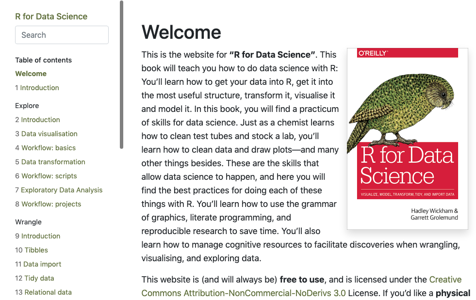
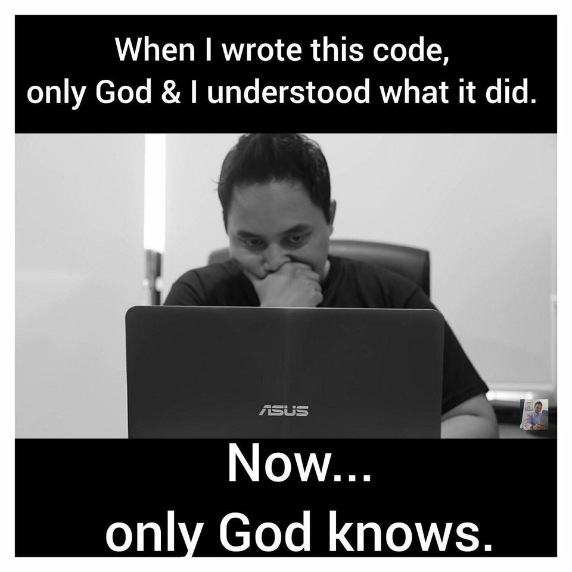

```{r setup, include=FALSE}
knitr::opts_chunk$set(echo = FALSE)
```

## What is R Markdown?

"This is an R Markdown presentation. Markdown is a simple formatting syntax for authoring HTML, PDF, and MS Word documents. For more details on using R Markdown see <http://rmarkdown.rstudio.com>."

--> Turns out that the first piece of information that I wanted to share with you was already here as the example text when I generated the presentation in RStudio :)

## Here's a short video introduction to RMarkdown from RStudio Inc.

```{r message = FALSE, warning = FALSE}
library("vembedr")
embed_url("https://vimeo.com/178485416")
```

## You might recognize this example...

This is the book "R for Data Science," created using R Markdown
{width=80%}
  

## Okay, but how can us non-book authors use R Markdown?

* presentations, like this one
* preparing materials for teaching or workshops that involve R (examples later!)
* the early stages of putting together a manuscript
* annotating your R code and including references
* getting organized and having everything in one place

*basically, any activity where you might want to weave together narrative text and code and/or code outputs (like figures)*

## You might recognize yourself here...

<center>

{width=50%}

</center>

## or here...

<center>

{width=60%}
</center>

## How can R Markdown help me get organized?

* **annotating your code** nicely so that you can remember what you did
* **including references or links**, e.g. that justify a particular analysis strategy or include documentation about a function or package
* **take notes** or write a couple sentences for your Results section as you produce figures

## How can R Markdown help me get organized?

Using Projects or an R notebook + R Markdown, you can have everything in one place (directory and output file):

* raw data
* code
* code outputs (plots, etc.)
* image files (e.g. conceptual figures)
* your narrative text (or just useful bits of information)

## Benefits of using R Markdown

* **Collaboration**: R Markdown makes it easier to share meaningful information about your data analysis with collaborators
* **Reproducibility**: your code *and* R Markdown output are reproducible and share-able
* **Version control**: your can connect RStudio and Github to have version control

## Version control...

<center>

{width=45%}

</center>

## Cool, what now?

* Carlos will give a practical demonstration of how easy it is to get started with R Markdown

* Each of us (India, Carlos and our special guest alumnus Ulfah) will show some examples of real-life R Markdown outputs

<center>

{width=45%}

</center>


